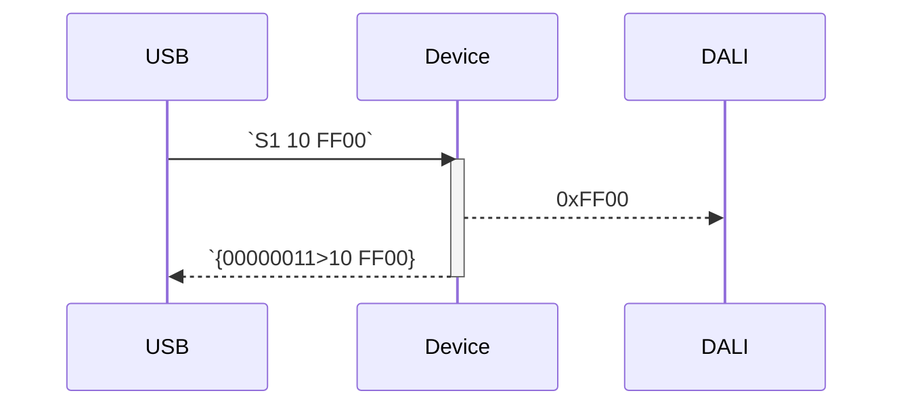
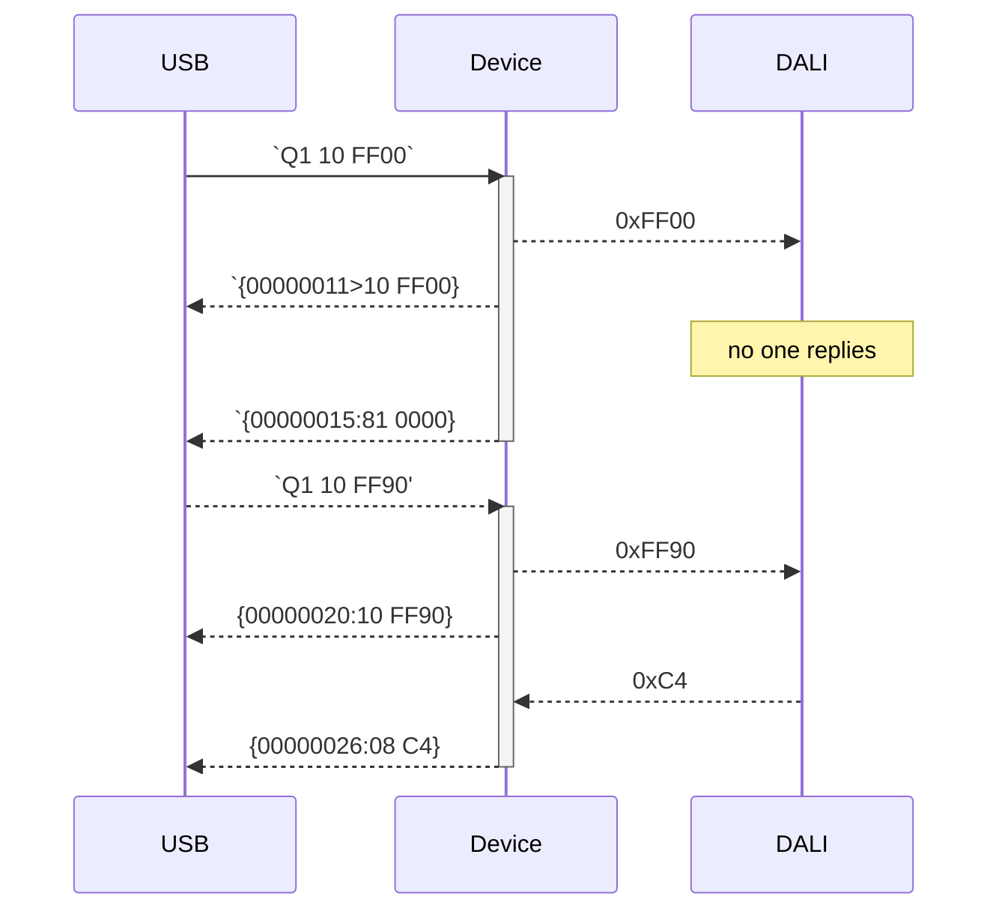

Output messages use the following format (except for the firmware information message) 

    '{' <timestamp> (':'|'>') <length> ' ' <data> '}'

    <timestamp> : integer number, 
                each tick represents 1 millisecond, 
                number is given in hex presentation, 
                fixed length of 8 digits
    
    <length>    : data bits received, or status code 
                number is given in hex presentation, 
                fixed length of 2 digits
                for status codes bit 7 is set, see table
    <data>      : received data payload, or additional information

Status Codes

 | Status Code | Description               | Information in `data`     |
 |------|----------------------------------|---------------------------|
 |   80 | No error                         | N/A                       |
 |   81 | Timeout                          | N/A                       |
 |   82 | Bad start bit timing             | Observed bit timing in µs |
 |   83 | Bad data bit timing              | Observed bit timing in µs |
 |   84 | Collision detected (loopback)    | N/A                       |
 |   85 | Collision detected (no change)   | N/A                       |
 |   86 | Collision detected (wrong state) | N/A                       |
 |   87 | Settling time violation          | N/A                       |
 |   90 | System is idle                   | N/A                       |
 |   91 | System has failure (bus low)     | N/A                       |
 |   92 | System has recovered             | N/A                       |
 |   A0 | Can not process command          | N/A                       |
 |   A1 | Bad argument to command          | N/A                       |
 |   A2 | Queue is full                    | N/A                       |
 |   A3 | Bad command                      | N/A                       |
 |   A4 | Buffer overflow                  | N/A                       |

