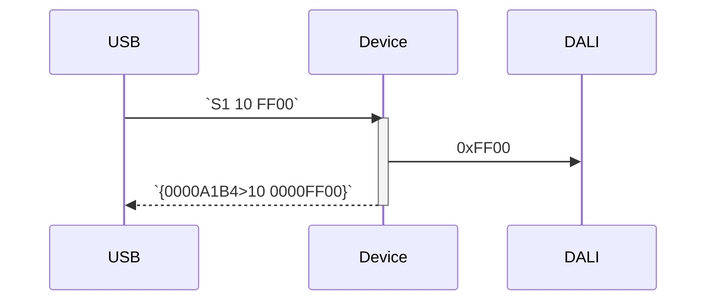
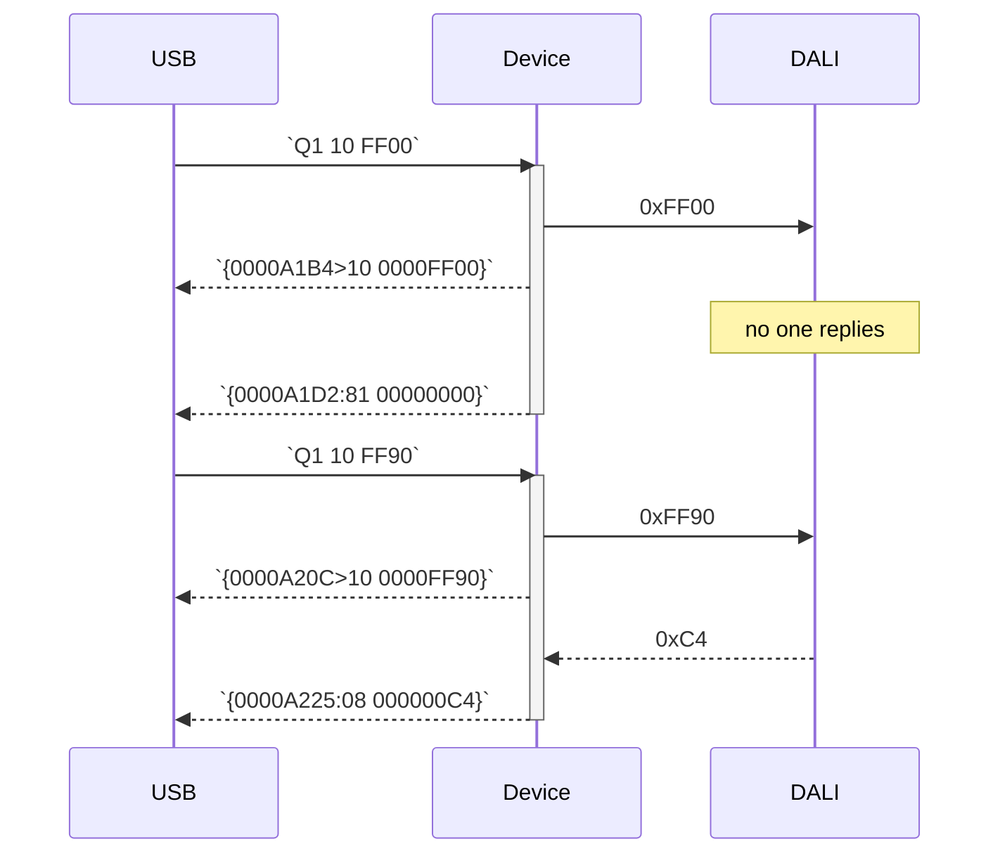

# Messages

## Output

The adapter receives all activities on the DALI bus. No matter if these were
transmitted by another bus device or the adapter itself.
Output messages use the following format (except for the firmware information message)

```syntax
'{' <timestamp> (':'|'>') <length> ' ' <data> '}'

<timestamp> : integer number,
            each tick represents 1 millisecond,
            number is given in hex presentation,
            fixed length of 8 digits

':'         : signals a received frame

'>'         : signals a loopback frame - the interface reads back its own transmission

<length>    : data bits received, or status code,
            number is given in hex presentation,
            fixed length of 2 digits,
            for status codes bit 7 is set, see table
<data>      : received data payload, or additional information,
            number is given in hex presentation,
            fixed length of 8 digits
```

## Status Codes

 | Status Code | Description                      | Information in `data`     |
 |-------------|----------------------------------|---------------------------|
 |        0x81 | Timeout                          | 0x00000000                |
 |        0x82 | Bad start bit timing             | Observed bit timing in µs |
 |        0x83 | Bad data bit timing              | Observed bit timing in µs |
 |        0x91 | System has failure (bus low)     | 0x00000000                |
 |        0x92 | System has recovered             | Low period in µs          |
 |        0xA0 | Can not process command          | 0x00000000                |
 |        0xA2 | Command queue is full            | 0x00000000                |
 |        0xA3 | Bad command                      | 0x00000000                |
 |        0xA5 | DALI message queue overflow      | 0x00000000                |

> [!NOTE]
> The observed bit timing is shifted by 8 bits to the left, and the lower 8 bits
> code the data bit where the timing error occurred.
> The duration of the low period is shifted the same way, with the lower 8 bits 0.
> Its 24 bits hold up to 16.7 s, a longer low period wraps around. The timestamp of
> 0x91 marks the start of the low period and the timestamp of 0x92 its end.

## Sequences

### Simple Frame Transmission


```mermaid
sequenceDiagram
    participant USB
    participant Device
    participant DALI
    USB ->> Device: `S1 10 FF00`
    activate Device
    Device ->> DALI: 0xFF00
    Device -->> USB: `{0000A1B4>10 0000FF00}`
    deactivate Device
```

### Query Request


```mermaid
sequenceDiagram
    participant USB
    participant Device
    participant DALI
    USB ->> Device: `Q1 10 FF00`
    activate Device
    Device ->> DALI: 0xFF00
    Device -->> USB: `{0000A1B4>10 0000FF00}`
    Note over DALI: no one replies
    Device -->> USB: `{0000A1D2:81 00000000}`
    deactivate Device
    USB ->> Device: `Q1 10 FF90`
    activate Device
    Device ->> DALI: 0xFF90
    Device -->> USB: `{0000A20C>10 0000FF90}`
    DALI -->> Device: 0xC4
    Device -->> USB: `{0000A225:08 000000C4}`
    deactivate Device
```
